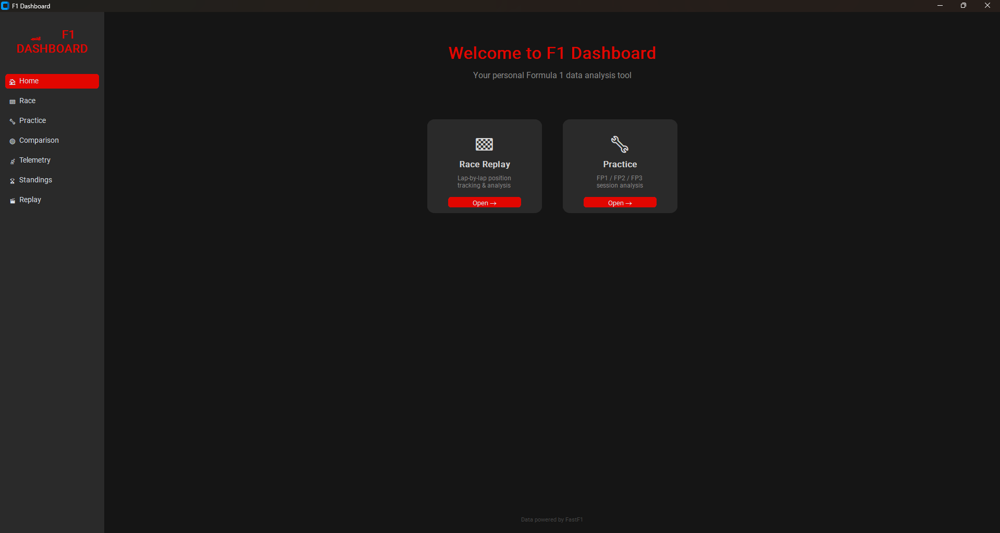
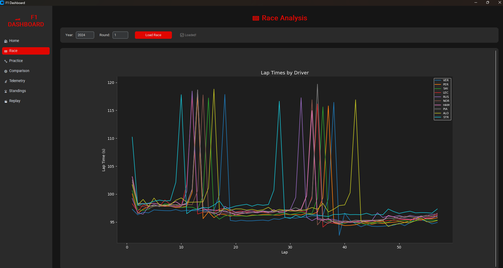
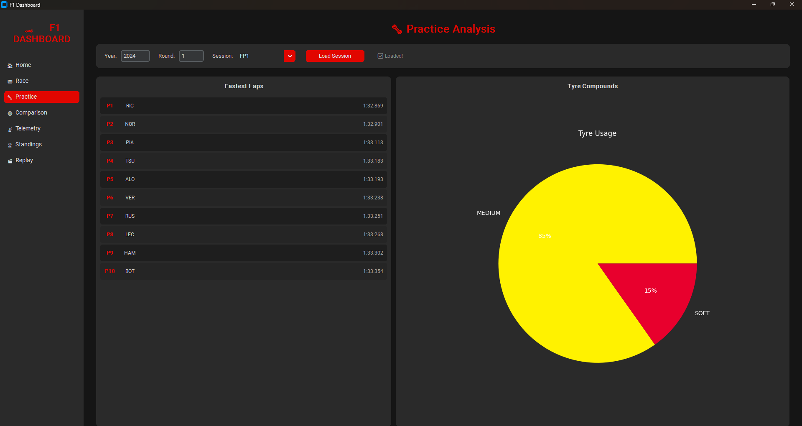
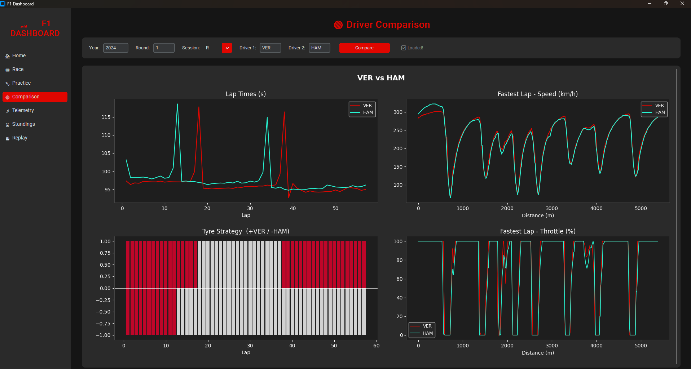
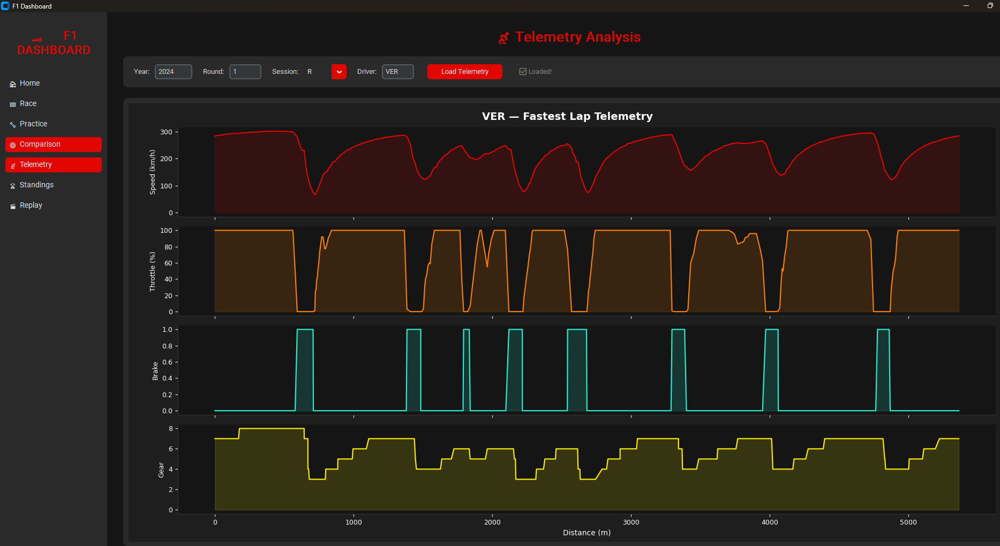
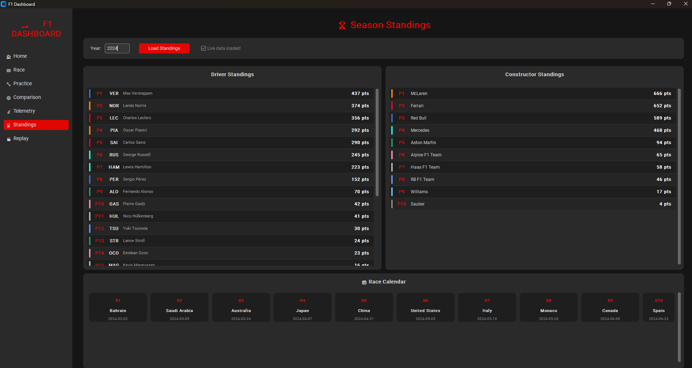
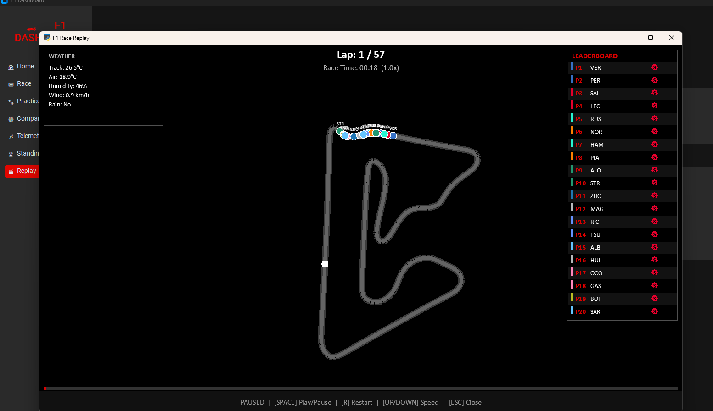

# 🏎️ F1 Dashboard

[](https://begum-f1-dashboard.streamlit.app)

An interactive Formula 1 data analysis application — available as a **web app** and a desktop app.

## Features

- 🏁 **Race Analysis** — Lap-by-lap time charts for all drivers
- 🔧 **Practice Analysis** — FP1/FP2/FP3 session data with fastest laps and tyre usage
- 🔵 **Driver Comparison** — Compare two drivers side by side (lap times, speed, throttle, tyre strategy)
- 📡 **Telemetry Analysis** — Speed, throttle, brake and gear data for fastest laps
- 🏆 **Season Standings** — Live driver and constructor standings + race calendar
- 🎬 **Race Replay** — Interactive track animation with live driver positions, leaderboard and weather panel

## Live Demo

🌐 **Web App:** https://begum-f1-dashboard.streamlit.app

## Tech Stack

- **Python** — Core language
- **FastF1** — F1 telemetry and session data
- **CustomTkinter** — Modern desktop UI
- **Matplotlib** — Charts and graphs
- **Arcade** — Race replay visualization
- **FastAPI** — REST API backend
- **Jolpica API** — Live standings data
- **Streamlit** — Web app interface

## Installation

```bash
# Clone the repository
git clone https://github.com/begumonegi/f1.git
cd f1
```

## Usage

```bash
venv\Scripts\activate
python main.py
```

Or simply double-click `run.bat`

## Data Source

All F1 data is powered by [FastF1](https://github.com/theOehrly/Fast-F1) and [Jolpica API](https://api.jolpi.ca).
## Screenshots







